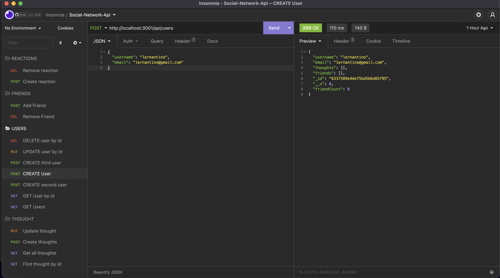

# social-network-api

## Description
The challenge is to build an API for a social network web application where users can share their thoughts, react to friends’ thoughts, and create a friend list. Using Express.js for routing, a MongoDB database, and the Mongoose ODM. In addition to using the Express.js

## Application Demo

This walkthrough video shows users:
* GET route to return all users in the database
* GET route to return a single user in the database
* POST route for creating a user in the database
* PUT route for updating a user in the database
* DELETE route to delete a user from the database
* Here's a link to the recorded video: https://watch.screencastify.com/v/4jEVhlB8mZThcxYL4sUo

This walkthrough video shows thoughts:
* GET route to return all thoughts in the database
* GET route to return a single thought in the database
* POST route for creating a thought in the database
* PUT route for updating a thought in the database
* Here's a link to the recorded video: https://watch.screencastify.com/v/e3D2aEq2P8NOPAB0p2b5

This walkthrough video shows friends:
* POST route for creating a friend to a user's friend list in the database
* DELETE route for deleting a friend to a user's friend list in the database
* Here's a link to the recorded video: https://watch.screencastify.com/v/lzzNI7p1coRRDlMwpWjT

This walkthrough video shows reactions:
* POST route for creating a reaction in the database
* DELETE route for deleting a reaction in the database
* Here's a link to the recorded video: https://watch.screencastify.com/v/R9dP2Y990wtXOG3gya7x

## Table of Contents
  - [Description](#description)
  - [Application Demo](#application-demo)
  - [Table of Contents](#table-of-contents)
  - [User Story](#user-story)
  - [Acceptance Criteria](#acceptance-criteria)
  - [Installation](#installation)
  - [Usage](#usage)
  - [Contributing](#contributing)
  - [Questions](#questions)

## User Story
* AS A social media startup
* I WANT an API for my social network that uses a NoSQL database
* SO THAT my website can handle large amounts of unstructured data
## Acceptance Criteria
* GIVEN a social network API
* WHEN I enter the command to invoke the application
* THEN my server is started and the Mongoose models are synced to the MongoDB database
* WHEN I open API GET routes in Insomnia for users and thoughts
* THEN the data for each of these routes is displayed in a formatted JSON
* WHEN I test API POST, PUT, and DELETE routes in Insomnia
* THEN I am able to successfully create, update, and delete users and thoughts in my database
* WHEN I test API POST and DELETE routes in Insomnia
* THEN I am able to successfully create and delete reactions to thoughts and add and remove friends to a user's friend list

## Installation
* Open the command line terminal and go to the proper directory
* Clone the git repo from :octocat: [kea6t](https://github.com/kea6t)
* Then type npm init to install dependencies
* Then npm i express
* Then enter: "node server" to launch 🚀
* Then open localhost:3001 to see app in insomnia

## Usage
* See the live version of the app here [Note Taker](https://saving-notes.herokuapp.com/)

## Contributing
:octocat: [kea6t](https://github.com/kea6t)

This was generated with ❤️ made by Kenny 🔥🌌🌳🦝🚀

## Questions
If you have any questions :grey_question:, please send me an email at: :e-mail: Email me with any questions: sampleEmail@gmail.com
